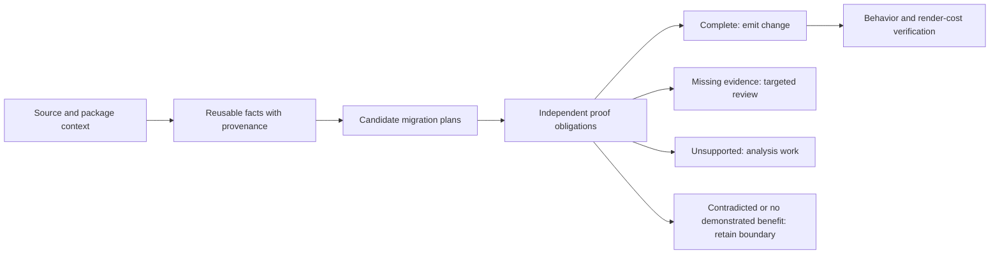

# Optimize for completed migrations

This replaces the long detector backlog as the implementation priority. The detailed research remains
in DETECTION-ROADMAP.md. The objective is a behavior-preserving migration that removes a demonstrated
render or lifecycle cost. Review count, number of recognizers, and number of yes/no questions are
secondary diagnostics.

## Implemented transition phase

The first phase now preserves source write relations, recognizes completed execution prefixes,
and distinguishes adjacent literal handoffs from unresolved or separate phases.
See [TRANSITION-VALIDATION.md](TRANSITION-VALIDATION.md) for the pinned survey-menu audit, runtime
contracts, and validation. Full migration planning and resumable proof obligations remain next steps.

## What the broader evidence says (baseline before this phase)

The pinned corpus contains 1,236 hooks, 523 manually labeled hooks, and 666 review findings. Labeled
recall is 93.9%, but that does not estimate recall over the 713 unlabeled hooks. Thirty-one actionable
hook findings are unlabeled. We need more independently audited evidence before treating any score
as an estimate of overall application quality.

| App                     | Reviews | Distinct open questions | No question or dependency |
| ----------------------- | ------: | ----------------------: | ------------------------: |
| legend-music            |      18 |                       1 |                        17 |
| excalidraw              |      90 |                      27 |                        56 |
| expensify               |     175 |                      54 |                        97 |
| formbricks              |     253 |                     138 |                        50 |
| outline                 |      77 |                      34 |                        35 |
| open-webui-react-native |       1 |                       1 |                         0 |
| hoalu                   |      52 |                      31 |                        17 |
| Total                   |     666 |                     286 |                       272 |

There are 336 findings carrying open questions, 58 dependent findings, and 272 unassisted findings.
An unassisted finding is not necessarily a missed optimization. It can be a real analysis gap, an
unsupported construct, or a case without demonstrated benefit.

The primary blocker histogram has 208 atomic-transition findings. However, the 38 distinct open group
questions describe 131 members: only 62 would convert upon confirmation; 69 remain blocked or retained.
These are conditional outcomes already recorded by the analyzer, not manual approvals, expected
runtime savings, or a forecast that 62 conversions are safe. The first blocker is not the whole plan.

## Why the current approach reaches diminishing returns

`classify-state.ts` tries an ordered list of verdicts and returns the first result. The inputs combine
many specialized boolean facts. This is a useful conservative recognizer, but its output does not
represent all obligations for a particular transformation.

`companion-writes.ts` records state-to-state co-write relationships, and `cowrittenGroup` traverses
their transitive closure. The resulting group loses the identity of the individual transitions that
connected the cells. This conservatively keeps related cells together, but it is too coarse to describe
exact publication boundaries or explain which small transition is preventing a migration.

Manually inspected pinned examples:

- Formbricks [`SurveyDropDownMenu`](https://github.com/formbricks/formbricks/blob/b344ddd73cfb0f7af86573176d53534a5321d982/apps/web/modules/survey/list/components/survey-dropdown-menu.tsx) joins seven flags in one group. Dropdown close/open handoffs,
  duplicate startup, and archive completion are different commands and phases. Its seven conditional
  member outcomes are conversions. This makes it a useful transition-planning fixture, not an
  automatically approved seven-state migration.
- Formbricks [`FeedbackRecordsTable`](https://github.com/formbricks/formbricks/blob/b344ddd73cfb0f7af86573176d53534a5321d982/apps/web/modules/ee/unify-feedback/components/feedback-records-table.tsx) joins eight cells. Refresh clears an error and starts pending;
  after an await, success writes records, cursors, selection, and pending, while failure takes a different
  path. Only three members have converting group outcomes. Removing one atomic blocker cannot solve
  its collection subscription, command capture, and mount problems.
- `hypotheses.ts` can ask that a child own no effects, memoization, or callbacks keyed on a prop. A
  more general migration should explicitly model a subscriber passing an ordinary React value to
  the existing child. Whether that preserves its effects and captures should be established as a
  reusable migration contract, rather than assumed from a child name or waived by a generic question.

## The target model

A migration plan should identify:

1. **Owner and lifetime:** the exact component/hook instance owning each cell.
2. **Write regions:** event entry, synchronous updates, await continuations, failure, cleanup, and
   handoffs, with the original ordering and all relevant co-writes preserved.
3. **Read behavior:** reactive reads, React render snapshots, command-entry snapshots, live reads,
   dependencies, mutable values refreshed by the render, and escaped values.
4. **Subscription boundaries:** actual stable JSX slots or row boundaries, their keys and gates,
   ordinary parent inputs, and the owner work excluded from each update.
5. **Proof obligations:** proven, unresolved, contradicted, or unsupported, with source evidence and
   exact dependencies. A failed obligation is not interchangeable with a missing source file.
6. **Verification:** behavior equivalence and a specific cost witness, separate from source-size proxies.

Hook findings remain useful locations in a report. Several findings can point to one migration plan;
a plan may contain multiple publication regions and multiple leaf subscribers. A shared source fact
can be reused across plans, but a confirmation must remain scoped to its invocation and assumptions.

## Three implementation priorities

### 1. Preserve transition structure

Extend the existing state-flow and mutation indexes with write-region evidence. Keep edges attached to
the originating calls, branches, and continuations. Derive migration groups from compatible regions
and their consumers; do not simply delete the existing companion-write guard.

Start with menu/dialog handoffs and finite async status commands. Require explicit evidence for every
batch boundary. Never introduce a batch spanning an await or move writes across an exception point.
Test success, rejection, early return, overlapping commands, and intermediate reader visibility.

Acceptance: the seven-flag dropdown example gets a fully explained, runtime-verified plan, or the
analyzer reports the precise remaining obstruction. A larger assumed group is not success.

### 2. Generalize the subscriber boundary transformation

Construct a concrete extraction plan: which JSX expression moves, which inputs remain ordinary React
props, which callbacks retain render snapshots, and which lifecycle remains in the owner. Reuse current
render-cut, key, alias, source-resolution, and callback proofs as evidence providers.

Prove a generic subscriber adapter against children with effects, memoization, render callbacks,
changing ordinary props, and conditional keys. Separate callback execution contracts from prop-reading
contracts. Reject owner subscriptions or mutable refresh dependencies that would leave the render cost
unchanged. Do not replace deferred captures with `.peek()` merely to make the plan fit.

Acceptance: behavior-preserving wrapper/alias refactors retain the same verdict; effect schedules,
callback snapshots, and mount identity match; the measured owner render cost falls.

### 3. Make review a resumable proof process

A review should show the proposed transformation, facts already proven, unresolved obligations, and
the exact source needed for each. Group shared research by dependency while preserving invocation
context. Hash the transitive evidence used by an answer, including package/config changes.

Keep partial answers without weakening the existing confirmation cap. Re-evaluate dependent plans
when a fact changes. Distinguish missing evidence, a known contradiction, unsupported analysis, and
lack of demonstrated benefit. Never use a percentage score as permission to override a hard gate.

Acceptance: repeated group findings produce one scoped research task, source changes invalidate the
right facts, and resolving one obligation exposes the remaining ones without pretending the plan is done.

## Rollout without a speculative rewrite

Keep the current classifier authoritative. Introduce the plan/obligation representation alongside it
and compare both on the frozen corpus. Existing structural recognizers should populate evidence first;
replace boolean-only interfaces incrementally. Promote one transformation family only after manually
audited labels, adversarial fixtures, and executable migration contracts agree.

Evaluate complete plans and independently audited missed opportunities. Stratify audits across apps,
blocker families, supported/unsupported syntax, and already-correct React boundaries. Keep an untouched
holdout before tuning against the new labels. Record owner and leaf renders per interaction, lifecycle
traces, and reviewer effort; JSX count times setter-site count is not measured update frequency.

## First foundation implemented in this pass

The evaluation runner now reports scoped, deduplicated review workload and the conditional group
frontier. It includes every app, even zero-review apps. Existing hook/practice scoring and detector
outputs are unchanged. This makes the mismatch between first blockers and completed plans measurable
on every subsequent evaluation instead of leaving it as a one-off observation.

| Risk                    | Contract / plausible defect                                                                | Test and oracle                                                                   |
| ----------------------- | ------------------------------------------------------------------------------------------ | --------------------------------------------------------------------------------- |
| Duplicate burden        | Repeated member findings must not count as separate questions                              | Two findings share one group; one question and one set of member outcomes         |
| Scope/version collision | Same relative id in another target or source version is different evidence                 | Three scoped/versioned questions remain three                                     |
| Inflated yield          | A blocked or retained member must not count as a conversion                                | One converting member and two remaining members, with only one known next blocker |
| Answer state            | Stale/rejected answers are not open research; dependencies and no-question findings differ | Explicit workload partition and zero-review app                                   |
| Measurement authority   | Evaluation cannot confirm assumptions or alter recommendations                             | Findings unchanged before/after measurement; existing scoring tests               |

Full runtime correctness of the proposed new planner is intentionally not claimed: the planner is the
next implementation phase. This pass implements its measurement foundation and changes the priority
from individual recognizers to transition structure and reusable subscription transformations.

The timing constraints are consistent with [React's update batching documentation](https://react.dev/learn/queueing-a-series-of-state-updates)
and [Legend State's reactivity and batching documentation](https://legendapp.com/open-source/state/v3/usage/reactivity/).
These API contracts constrain the future proof model; they do not approve a specific application migration.

## Validation of the measurement foundation

`npm run check` passed: lint, formatting, TypeScript, build, 863 tests, and package dry run.
Four temporary compiled-code mutations were caught: dropping target scope, dropping source version,
counting blocked group members as conversions, and admitting inactive answers into the open queue.
Each mutation was restored before the full checks.

The full seven-app pinned evaluation passed. All 237 target reports are unchanged, not just their
action counts. Hook labels remain 508/523, grouped instructions 10/10, questions 5/5, and practices
71/71. Labeled actionable precision/recall remain 100%/93.9%. The next recorded group blockers are
render cuts (26), child contracts (22), mount identity (10), ownership flow (6), effect ownership (3),
and no demonstrated benefit (2); these counts are conditional on group confirmation.

| App                     | Action delta in this measurement phase |
| ----------------------- | -------------------------------------: |
| legend-music            |                                      0 |
| excalidraw              |                                      0 |
| expensify               |                                      0 |
| formbricks              |                                      0 |
| outline                 |                                      0 |
| open-webui-react-native |                                      0 |
| hoalu                   |                                      0 |

Before/after Legend Doctor self-scans both returned `status: ok`, seven hooks, and zero practice
findings. No detector thresholds, hypothesis authority, or corpus labels were changed in this phase.
